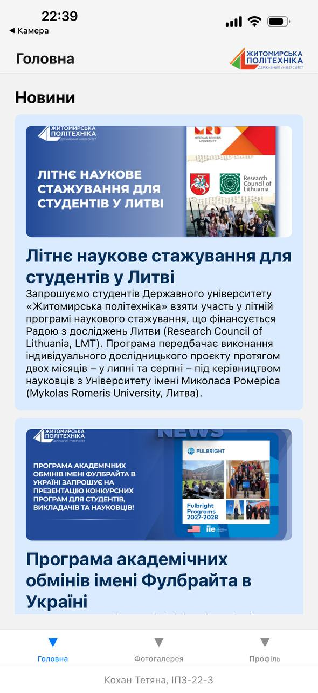
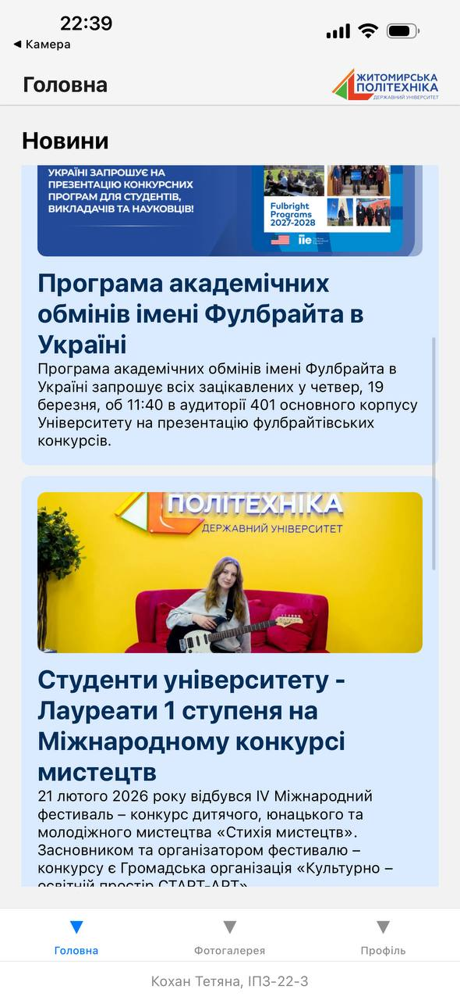
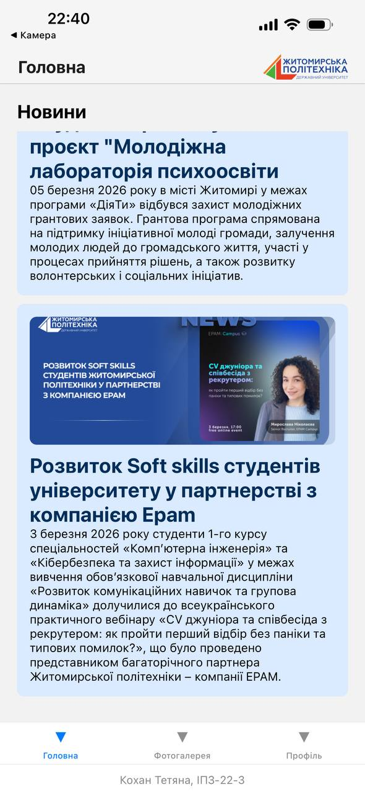
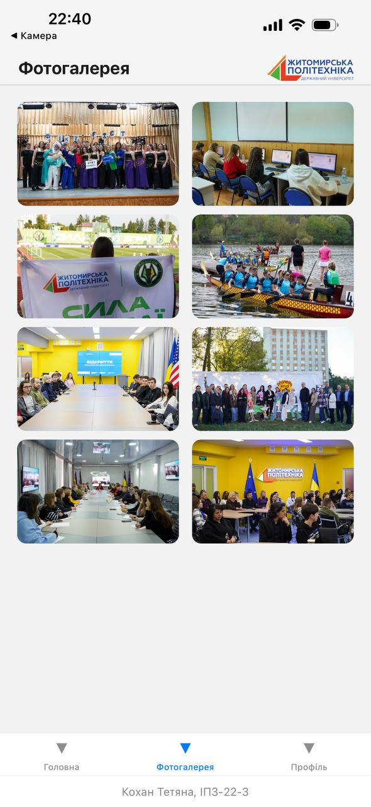
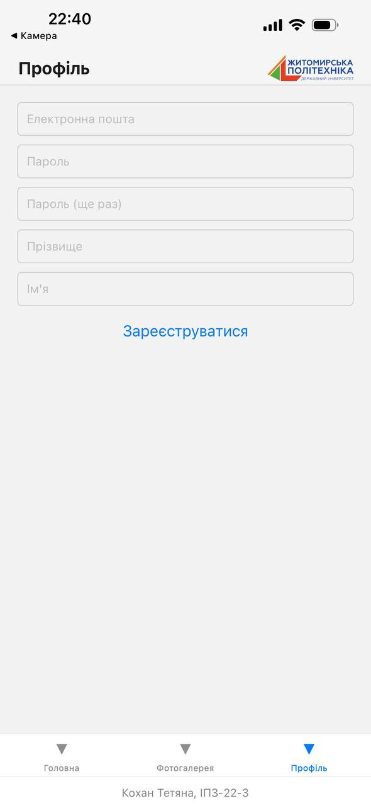

# Перший мобільний додаток
Створено мобільний додаток для перегляду новин університету, фотогалереї та реєстрації користувачів.

## Опис проєкту:
Додаток створено на **React Native** з використанням **Expo**.  
Основні функції:
- Перегляд новин, які мають заголовок, зображення та основний текст
- Перегляд фотогалереї
- Реєстрація користувача

## Скріншоти екранів застосунку:
**Головний екран (Новини):**  

**Фотогалерея:**  

**Реєстрація:**  

## Онлайн версія проєкту:
Можна переглянути та протестувати цей додаток онлайн у **Expo Snack**:
[Відкрити проєкт у Expo Snack](https://snack.expo.dev/@tetiana_kokhan/lab1)
## Локальний запуск на комп’ютері (Expo CLI):
Щоб запустити додаток локально, потрібно мати встановлений Node.js та Expo CLI.
**Кроки запуску:**
1. Склонуйте репозиторій на свій комп’ютер: 
*git clone <https://github.com/KokhanTetiana/MobileLabsRN2026.git>*
2. Перейдіть у папку проєкту та встановіть залежності: 
*cd lab1* 
*npm install*
3. Запустіть проект: 
*npm start*
4. Відкрийте додаток на пристрої чи емуляторі: 
Відскануйте QR-код у додатку Expo Go на телефоні (Android або iOS).
Або натисніть **a** для Android емулятора / **i** для iOS емулятора у терміналі.

