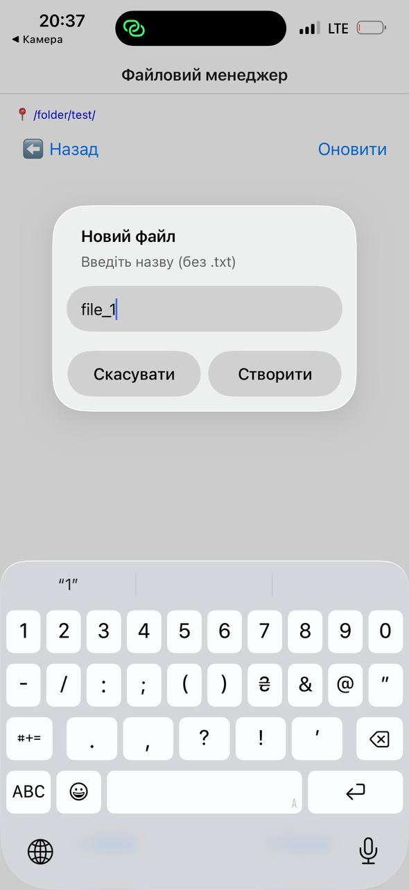
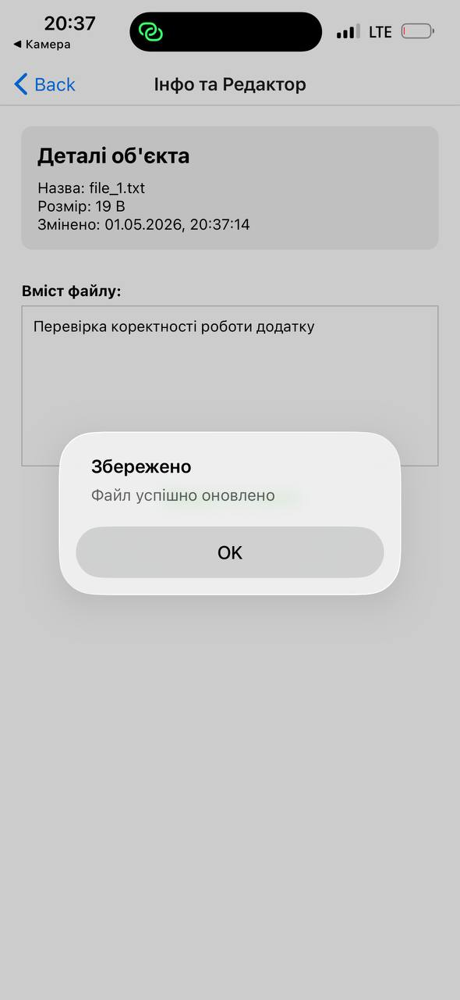

# Лабораторна робота №4

## Робота з файловою системою в React Native з використанням бібліотеки expo-file-system.

---

## 🗒️ Інструкція запуску проєкту
### Клонування репозиторію
```bash
git clone https://github.com/KokhanTetiana/MobileLabsRN2026.git
```
```bash
cd MobileLabsRN2026
```
Перехід у проєкт лабораторної
```bash
cd lab4
```
Встановлення залежностей
```bash
npm install
```
▶️ Запуск проєкту
```bash
npx expo start
```
---

## Функціонал

### Файлова навігація

* Динамічне відображення шляху: Реалізовано виведення поточного місцеперебування користувача у форматі 📍 /шлях/.

* Деревоподібна структура: Можливість переходу у вкладені директорії та коректне повернення на рівень вгору (механізм "Back").

* Автоматичне оновлення: Список файлів оновлюється миттєво після створення або видалення об'єктів.

### Операції з файлами та папками

* Створення: * Створення нових папок через діалогові вікна (Alert.prompt).

* Створення текстових файлів (.txt) з базовим наповненням.

* Редагування: Повноцінний вбудований текстовий редактор для модифікації вмісту файлів.

* Видалення: Безпечне видалення файлів та директорій з файлової системи.

### Робота з метаданими

На екрані деталей відображається повна інформація про об'єкт:

* Тип об'єкта (файл/папка).

* Точний розмір у байтах/КБ/МБ (з використанням функції форматування).

* Дата та час останньої модифікації.

## 📸 Скріншоти

Головна сторінка файлового менеджера


Створення нового каталогу


Успішне створення каталогу


Створення файлу у новому каталозі



Успішне створення файлу


Сторінка редагування файлу



## Висновок

Під час виконання лабораторної роботи було опановано практичні навички роботи з локальною файловою системою мобільного пристрою за допомогою бібліотеки expo-file-system у середовищі React Native. Реалізовано повний цикл операцій з файловою системою: від динамічної навігації між директоріями до створення, редагування та видалення файлів і папок.