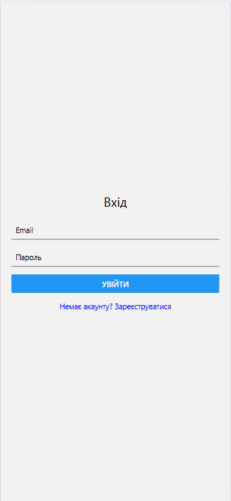
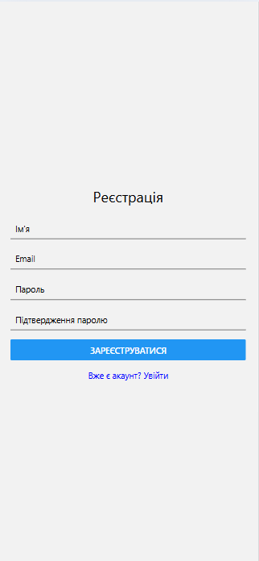

# Лабораторна робота №5

## Побудова навігації у React Native із використанням бібліотеки Expo Router.

---

## 🗒️ Інструкція запуску проєкту
### Клонування репозиторію
```bash
git clone https://github.com/KokhanTetiana/MobileLabsRN2026.git
```
```bash
cd MobileLabsRN2026
```
Перехід у проєкт лабораторної
```bash
cd lab5
```
Встановлення залежностей
```bash
npm install
```
▶️ Запуск проєкту
```bash
npx expo start
```
---

## Функціонал

### Expo Router (file-based navigation)

Реалізовано навігацію через файлову структуру /app

Використано групи маршрутів:
* (auth) — публічні екрани
* (app) — захищені екрани

---

### Публічні екрани

* Login screen
* Register screen
Перехід між екранами через `<Link />`

Виклик функцій login/register

---

### Каталог товарів

Головний екран (index.jsx)

Відображення списку товарів через FlatList

Картки містять:
* зображення
* назву
* ціну
* Кнопка Logout

---

### Динамічні маршрути

Екран деталей: /details/[id]

Використано useLocalSearchParams

Відображення:
* фото товару
* назва
* ціна
* опис

---

### Обробка неіснуючих сторінок

Реалізовано +not-found.jsx

Повідомлення "Екран не знайдено"

Кнопка повернення на головну

## 📸 Скріншоти

Сторінка входу


Сторінка реєстрації


Сторінка з товарами


Сторінка деальної інформації про товар


Перехід на неіснуючу сторінку


---

## Висновок

У ході виконання лабораторної роботи було вивчено концепцію file-based маршрутизації у Expo Router. Реалізовано структуру з публічними та захищеними маршрутами, систему авторизації через контекст, динамічні маршрути для сторінок деталей, а також обробку неіснуючих сторінок. Отримано практичні навички побудови сучасної навігації у мобільних застосунках.

---

## ❓ Контрольні запитання

**1. Яким чином за допомогою Expo Router реалізується перенаправлення неавторизованого користувача?**

У файлі `_layout.jsx` перевіряється стан isAuthenticated. Якщо користувач не авторизований, використовується `<Redirect href="/login" />` для автоматичного перенаправлення на екран входу. 

**2. У чому полягає різниця між використанням компонента `<Link>` та метода router.push()?**

`<Link>` використовується в JSX для навігації через UI (декларативно). 
`<Link>` — це навігація через інтерфейс. Ти ніби “натискаєш кнопку/посилання” на екрані, і тебе переводить на інший екран.

`router.push()` викликається у коді (імперативно), наприклад після логіну або обробки події. 
`router.push()` — це навігація через код. Перехід відбувається автоматично після якоїсь дії (наприклад, після входу, перевірки або умови), без натискання користувачем.

**3. Як працюють динамічні маршрути в Expo Router і як отримати передані параметри?**

Динамічні маршрути створюються через `[id].jsx.`
Параметри отримують через `useLocalSearchParams():`

`const { id } = useLocalSearchParams();`

**4. Чому стан авторизації доцільно зберігати у глобальному контексті (React Context), а не в локальному стані компонента?**

Щоб мати доступ до авторизації в усьому застосунку. Це дозволяє не передавати props через багато компонентів і централізовано керувати `login/logout`.

**5. Для чого використовуються групи маршрутів (folderName) і як вони впливають на URL-адресу?**

Групи `(auth)`, `(app)` використовуються для структури проєкту, але не впливають на URL. Вони допомагають організувати екрани без зміни адрес маршруту.
