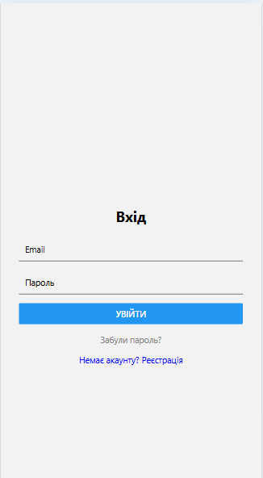
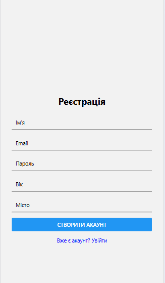
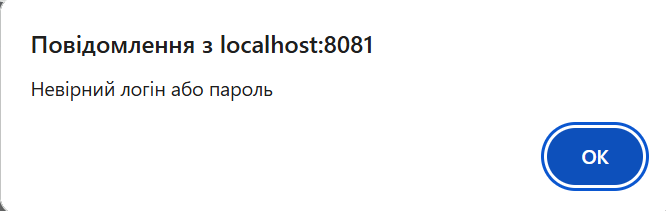
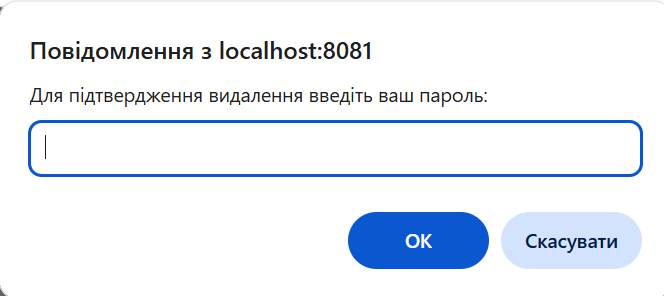

# Лабораторна робота №6

## Побудова авторизації та збереження персональних даних у ReactNative з використанням Firebase Authentication та Firestore.

---

## 🗒️ Інструкція запуску проєкту
### Клонування репозиторію
```bash
git clone https://github.com/KokhanTetiana/MobileLabsRN2026.git
```
```bash
cd MobileLabsRN2026
```
Перехід у проєкт лабораторної
```bash
cd lab6
```
Встановлення залежностей
```bash
npm install
```
▶️ Запуск проєкту
```bash
npx expo start
```
---

## Основний функціонал

### Система авторизації (Firebase Authentication)

* Реєстрація та вхід: реалізовано форми для створення нового облікового запису та доступу до існуючого за допомогою email та пароля.

* Скидання пароля: додано функцію resetPassword, яка використовує Firebase API для надсилання інструкцій з відновлення на електронну пошту.

* Управління сесією: реалізовано вихід із системи та автоматичний перенаправлення користувача залежно від його статусу (авторизований/гість).

### Робота з базою даних (Cloud Firestore)

* Профіль користувача: при реєстрації створюється документ у колекції users із унікальним ID користувача (uid).

* Збереження даних: реалізовано можливість зберігати та оновлювати персональну інформацію (ім’я, вік, місто).

* Правила безпеки: налаштовано Firestore Security Rules, які гарантують, що користувач має доступ (читання/запис/видалення) лише до свого власного документа.

### Редагування та видалення облікового запису

* Оновлення даних: реалізовано функцію редагування профілю через Firestore.

* Видалення акаунта: впроваджено механізм повного видалення профілю. Процес включає повторну автентифікацію (re-authentication) для безпеки, після чого видаляються дані з Firestore та сам запис користувача з Authentication.

### Навігація та архітектура (Expo Router)

* Файлова навігація: використано структуру /app із розподілом на групи (auth) та (app).

* Динамічні маршрути: реалізовано перехід до деталей товару через маршрут /details/[id].

* AuthContext: використано React Context API для глобального доступу до даних користувача та функцій авторизації в усіх частинах застосунку.

### Інтерфейс та відображення

* Каталог товарів: виведення списку товарів за допомогою компонента FlatList.

* Адаптивність: повідомлення про помилки та успішні дії адаптовані як для мобільних пристроїв (Alert.alert), так і для веб-версії (window.alert).


## 📸 Скріншоти

Сторінка входу


Сторінка реєстрації


Сторінка з товарами після успішного входу користувача


Сторінка детальної інформації про товар


Профіль користувача та функціональні можливості (редагування, вихід, видалення акаунту)


Перехід на неіснуючу сторінку


Наявність відповідних перевірок, щодо коректності введених даних та роботи програми






---

## Висновок

У ході виконання лабораторної роботи було розроблено мобільний застосунок на базі React Native (Expo) з інтеграцією Firebase Authentication та Firestore для реалізації авторизації та збереження персональних даних користувачів.

Під час роботи було реалізовано основні функції системи автентифікації: реєстрація користувача, вхід у систему, вихід з акаунта, відновлення пароля, оновлення та видалення профілю. Також було організовано збереження додаткової інформації про користувача у базі даних Firestore.
